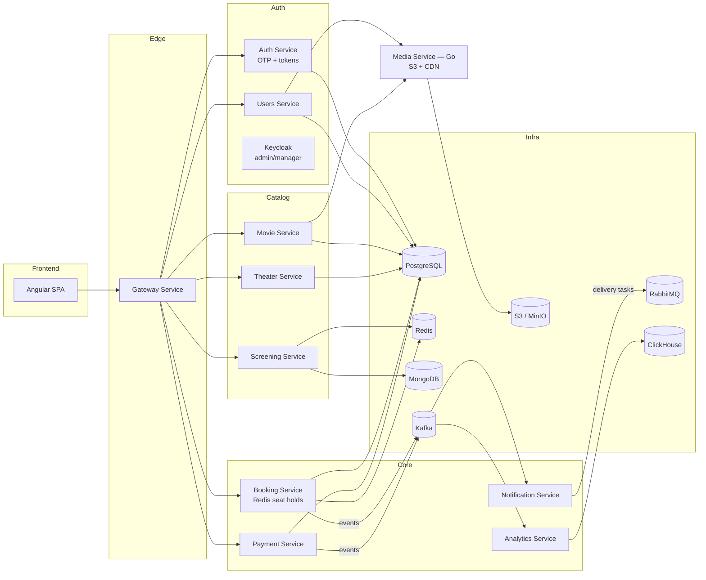

# CineFlow

[](https://github.com/Aiko2004/cineflow/actions/workflows/backend-ci.yml)

A cinema ticket-selling platform built on a microservices architecture — a learning and
portfolio project. It reimplements the backend of the [TeaCinema](https://github.com/TeaCoder52/teacinema-public)
course project (originally NestJS/TypeScript) on **Java 21 / Spring Boot 4**, keeping the
same service decomposition and messaging layer. The domain flows from movies → theaters/halls →
screenings → seat selection → booking → ticket with a QR code. The focus is on the engineering
problems a distributed system forces you to solve — concurrency on a shared resource (a seat),
token rotation, service-to-service contracts, resilience, schema migrations — rather than on
breadth of features.

## Architecture

### Implemented services

| Service | Port | Storage | Responsibility |
|---|---|---|---|
| `eureka-server` | 8761 | — | Service discovery |
| `api-gateway` | 8080 | — | Single entry point, routing, JWT verification |
| `movie-service` | 8081 | PostgreSQL | Movies and categories |
| `theater-service` | 8082 | PostgreSQL | Theaters, halls, seats |
| `screening-service` | 8083 (+ gRPC 9083) | MongoDB | Screenings as denormalized documents |
| `auth-service` | 8084 | PostgreSQL + Redis | Accounts, OTP login, JWT issuing/refresh |
| `booking-service` | 8085 | PostgreSQL + Redis | Seat holds, bookings, QR tickets |

Each relational service owns its own logical database (`movies`, `theater`, `auth`, `booking`)
on a shared PostgreSQL instance. Inter-service calls are REST/Feign by default; the single
gRPC call is `booking → screening`.

### Target architecture

The diagram below is the **full target** vision from [`docs/PROJECT_PLAN.md`](docs/PROJECT_PLAN.md).
Services drawn here that are not in the table above (Payment, Notification, Analytics, Media,
Users, Keycloak) are **planned, not yet built** — see [Status](#status).



## Tech stack

- **Java 21**, **Spring Boot 4.1.1**, **Spring Cloud 2025.1.3**
- **Gradle** (Kotlin DSL) multi-module monorepo; Lombok; springdoc OpenAPI
- **PostgreSQL** (Flyway migrations), **MongoDB**, **Redis**
- **gRPC** (protobuf) for the `booking → screening` call
- **Resilience4j** (circuit breaker, bulkhead, retry) on external calls
- **Testcontainers** for integration tests
- Planned: Kafka, RabbitMQ, Keycloak, ClickHouse, S3/MinIO, Angular frontend

## Key engineering decisions

- **"One seat, sold once" is guaranteed by a partial unique index**, not by application code:
  `uk_seat_taken ON booking_seats (screening_id, seat_id) WHERE released_at IS NULL`. Redis
  holds and the sweeper are an optimization around it; correctness survives a Redis outage.
  See [`docs/BOOKING_DESIGN.md`](docs/BOOKING_DESIGN.md).
- **Refresh-token rotation with reuse detection.** Each refresh is single-use; presenting an
  already-revoked token revokes the entire token family (both thief and owner). Rotation is
  settled by an atomic conditional `UPDATE`, so two concurrent rotations cannot both win.
  See [`docs/AUTH_DESIGN.md`](docs/AUTH_DESIGN.md).
- **Passwordless login via email OTP**, RS256-signed JWTs with a public JWKS endpoint — the
  private key never leaves `auth-service`; resource servers fetch and cache public keys and
  re-fetch on an unknown `kid`, so key rotation needs no restart. See [`docs/AUTH_DESIGN.md`](docs/AUTH_DESIGN.md).
- **gRPC `booking → screening`** for screening validation + denormalization data in one call;
  the `.proto` lives in the shared `contracts` module and is the contract for both server and
  client. Everything else inter-service is REST/Feign. See [`docs/BOOKING_DESIGN.md`](docs/BOOKING_DESIGN.md) §5.
- **Keyset (cursor) pagination** for the screening scroll endpoint — the cursor encodes
  `(startAt, id)` and is stable under inserts (no duplicates or gaps), unlike offset pagination.
  See [`CLAUDE.md`](CLAUDE.md).
- **Flyway with expand-contract migrations** and `ddl-auto: validate` (never `update`):
  destructive changes are split across releases so an app rollback never hits a dropped column.
  See [`CLAUDE.md`](CLAUDE.md).
- **Defense in depth** — JWT is verified both at the gateway and inside each resource service,
  so a caller already inside the network still can't reach a protected endpoint.
- **Resilience4j** wraps both the gRPC and Feign calls (circuit breaker + bulkhead + retry);
  resilience works at the method level, independent of transport.

## Running locally

Requires **JDK 21** and **Docker**. All commands run from `microservices-backend/`.

```bash
cd microservices-backend

# 1. Start infrastructure (PostgreSQL, MongoDB, Redis). The postgres-init companion
#    creates the per-service databases idempotently on every `up`.
docker compose up -d

# 2. Build everything (runs Testcontainers integration tests — Docker must be running).
./gradlew build

# 3. Start eureka-server FIRST, then the other services (each in its own terminal).
./gradlew :eureka-server:bootRun
./gradlew :movie-service:bootRun
# ...theater, screening, auth, booking, api-gateway
```

Check the Eureka dashboard at http://localhost:8761 to confirm services registered.

Configuration uses `${VAR:default}` placeholders; copy `.env-example` to `.env` to override.
If native PostgreSQL/Redis already occupy ports 5432/6379, start the containers on other ports:
`DB_HOST_PORT=5433 REDIS_HOST_PORT=6380 docker compose up -d` and pass `DB_PORT`/`REDIS_PORT`
to the services.

A `Makefile` provides short aliases (`make infra-up`, `make run-movie-service`,
`make test-booking-service`, `make psql DB=booking`). On Windows run it from Git Bash with
`make` installed separately (`scoop install make` or `choco install make`).

## Status

**Built and working end-to-end** (verified live through the gateway on a clean Docker volume):
service discovery, gateway with JWT, movie / theater / screening catalogs, OTP auth with
refresh rotation, and booking (seat hold → booking via gRPC + Feign → confirm with QR → cancel →
rebook). The build is green including Testcontainers integration tests.

**Not started / planned** (see the roadmap in [`docs/PROJECT_PLAN.md`](docs/PROJECT_PLAN.md)):

- Payment service and the Booking ↔ Payment saga (the current booking increment has no payment)
- Notification service (Kafka → RabbitMQ) and Analytics service (ClickHouse)
- Media service (Go, via gRPC) and Users service
- Keycloak for admin/manager roles
- Externalizing the JWT signing key (currently ephemeral, generated at startup)
- **Angular frontend — not started**

For the detailed current state, accepted decisions with rationale, and open debts, see
[`docs/CURRENT_STATE.md`](docs/CURRENT_STATE.md). Project conventions are documented in
[`CLAUDE.md`](CLAUDE.md).

## License

[MIT](LICENSE)
