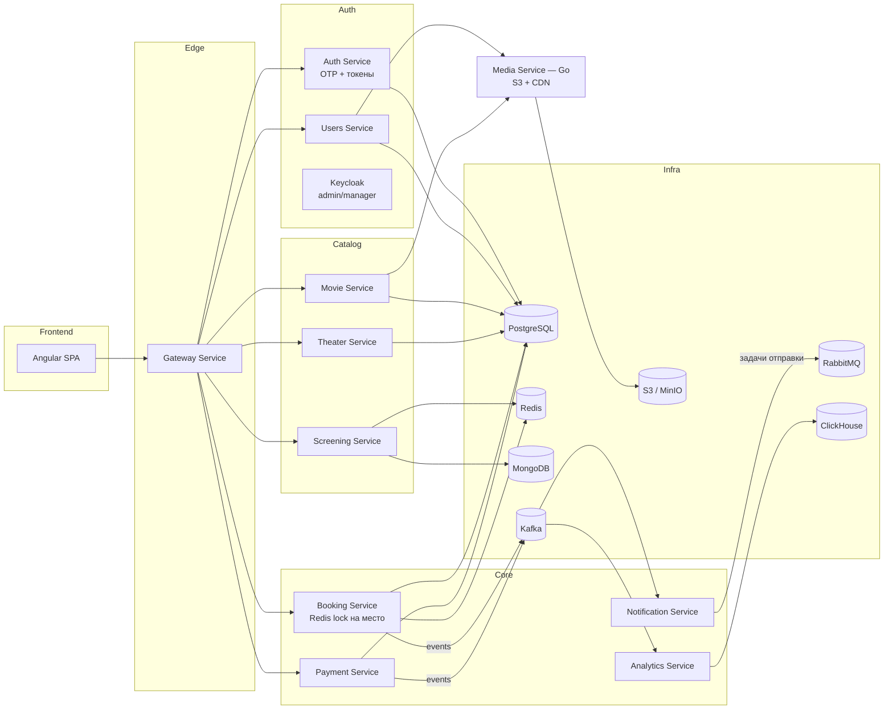

# CineFlow — план проекта

## 1. Идея

Сервис продажи билетов в кино — переосмысление учебного проекта [TeaCinema](https://github.com/TeaCoder52/teacinema-public) (курс по микросервисной архитектуре). В оригинале бэкенд на **NestJS/TypeScript**, фронтенд на Next.js. Наша версия: бэкенд на **Java/Spring** (та же декомпозиция сервисов, тот же брокерский слой), фронтенд — на **Angular**. Media Service (Go) берём как есть — он и в оригинале на другом языке и подключается через gRPC, так что интеграция с ним повторяет реальный опыт работы с полиглотным сервисом.

Домен: фильмы → кинотеатры/залы → сеансы → выбор мест на схеме зала → бронь + оплата → билет с QR-кодом → личный кабинет.

## 2. Сервисы оригинала → наш стек

Декомпозиция подтверждена таймкодами курса — проверенная, а не придуманная:

| # | Оригинал (NestJS/TS) | У нас (Java/Spring) | Роль |
|---|---|---|---|
| 1 | Gateway Service | `api-gateway` (Spring Cloud Gateway) | Входная точка, роутинг, проверка JWT |
| 2 | Auth Service | `auth-service` | Аккаунты, OTP-коды, выдача/рефреш токенов |
| 3 | Notification Service | `notification-service` | Email/SMS через **RabbitMQ** |
| 4 | Users Service | `users-service` | Профили (отдельно от Auth — аккаунт и профиль разделены) |
| 5 | Media Service | `media-service` (**остаётся на Go**) | Постеры, аватары, S3, gRPC |
| 6 | Movie Service | `movie-service` | Фильмы и категории |
| 7 | Theater Service | `theater-service` | Кинотеатры, залы, места |
| 8 | Screening Service | `screening-service` | Расписание сеансов (**MongoDB**) |
| 9 | Payment Service | `payment-service` | Платежи и возвраты |
| 10 | Booking Service | `booking-service` | Логика бронирования |

Плюс инфраструктурные, которых нет в списке курса: `eureka-server` (service discovery) и `analytics-service` (ClickHouse — стретч сверх оригинала).

**Осознанное отличие от оригинала**: Keycloak поверх Auth Service, но только для внутренних ролей (админ кинотеатра, менеджер зала). Обычные клиенты, как и в оригинале, идут через Auth Service с OTP.

## 3. Доменная модель (из реального API-контракта фронтенда)

| Сущность | Смысл |
|---|---|
| Movie | фильм: title, slug, poster, banner, ratingAge, trailer, releaseDate |
| Theater | кинотеатр: name, address |
| Hall | зал внутри кинотеатра |
| Screening | сеанс: фильм + зал + `startAt`/`endAt` + `seatTypes`. Хранится в MongoDB как денормализованный документ |
| Seat | место в зале: ряд, номер, тип (NORMAL/VIP) |
| Booking | бронь: сеанс + список мест + QR-код |
| PaymentMethod | сохранённая карта (redirect + verify) |
| Payment | платёж, инициируется вместе с бронью через `/payment/init` |
| Refund | возврат по брони |
| User | профиль, email/телефон, аватар |

**Ключевая деталь**: отдельного «создать бронь» эндпоинта в оригинале нет — `POST /payment/init` с `screeningId` и списком `seats` создаёт бронь и платёж одновременно. Это и есть сага.

### Точные формы из контракта фронтенда

```typescript
ScreeningResponse        { id, startAt, endAt, hallId, theater, hall, movie, seatTypes[] }
ScreeningMovieResponse   { id, title, slug, banner }
ScreeningHallResponse    { id, name }
ScreeningTheaterResponse { id, name, address }
ScreeningSeatTypeResponse{ type, price }
GetAllMoviesResponse     { id, title, slug, poster, banner, ratingAge?, trailer?, releaseDate }
GetAllTheatersResponse   { id, name, address }
GetUserBookingsResponse  { id, screeningDate, screeningTime, movie, theater, hall, seats[], qrCode }
InitPaymentRequest       { savePaymentMethod?, paymentMethodId?, screeningId, seats[] }
```

Все `id` типизированы как `string` → в оригинале UUID во всех сервисах.

## 4. Архитектура



### Синхронная связь — гибрид REST и gRPC

| Связь | Протокол | Почему |
|---|---|---|
| Angular ↔ Gateway | REST/JSON | Удобнее клиенту, легко дебажить |
| Gateway ↔ внутренние сервисы | REST/JSON | Простота, не нужен grpc-web на границе |
| Java ↔ Java (Booking ↔ Screening/Payment) | REST/Feign | Так делает большинство команд — нет причины для gRPC без кросс-языковой или нагрузочной необходимости |
| Users/Movie ↔ Media Service | **gRPC** | Необходимость: Media на Go, строгий контракт между языками |
| Booking ↔ Screening (проверка мест) | **gRPC** | Осознанная учебная практика на самом частом внутреннем вызове |

### Kafka vs RabbitMQ — разные роли

**Kafka** — событийный лог домена (`booking.created`, `payment.completed`), читают несколько независимых consumer'ов (Notification, Analytics), события durable и replayable.

**RabbitMQ** — очередь задач: Notification Service, получив событие из Kafka, кладёт конкретную задачу «отправить это письмо / SMS» с retry и dead-letter queue. Так это устроено в оригинале курса.

## 5. Роли технологий

| Технология | Роль |
|---|---|
| Java 21 + Spring Boot 4.1.1, Spring Cloud 2025.1.3 | Backend-сервисы |
| PostgreSQL | Данные Movie, Theater, Auth, Users, Booking, Payment (БД на сервис) |
| MongoDB | БД Screening Service: сеанс как денормализованный документ, без join'ов на горячем read-пути |
| Redis (Redisson) | Lock на место при бронировании, кэш расписания |
| Apache Kafka | Событийный лог, saga, источник для аналитики |
| RabbitMQ | Очередь задач доставки уведомлений с retry/DLQ |
| Keycloak | Auth для admin/manager ролей |
| Auth Service | OTP, аккаунты, токены для обычных пользователей |
| ClickHouse | Аналитика продаж (стретч) |
| S3 + CDN | Медиа через Media Service (Go) |
| Angular 17+ | SPA: клиент + админка |

## 6. Frontend — карта экранов (Next.js → Angular)

| Экран (Next.js) | Angular | Бэкенд |
|---|---|---|
| `(site)/page.tsx` — главная | `/` | Movie |
| `(site)/movies` — каталог | `/movies` | Movie |
| `(site)/movies/[slug]` — карточка фильма | `/movies/:slug` | Movie + Screening |
| `(site)/schedule` — расписание | `/schedule` | Screening |
| `(site)/screening/[id]` — выбор мест + оплата | `/screening/:id` | Screening + Booking + Payment |
| `(site)/theaters` | `/theaters` | Theater |
| `account/**` (tickets + QR, payment-methods, settings) | `/account/**` | Booking, Payment, Users, Media |
| `auth/login`, `auth/telegram` | `/auth/**` | Auth |
| `onboarding` | `/onboarding` | Auth |

Схема мест (`seats-canvas.tsx` — HTML canvas) — самый нетривиальный компонент для переноса.

## 7. Roadmap по фазам

| Фаза | Содержание | Время (part-time) |
|---|---|---|
| **0 — Скелет** | Eureka, Gateway, Movie + Theater (Postgres), Screening (MongoDB), Angular: главная/каталог/расписание | 4–5 недель |
| **1 — Auth + Users** | Auth Service (OTP), Users Service, Keycloak realm для admin | 2 недели |
| **2 — Redis** | Lock на место, кэш расписания | 1 неделя |
| **3 — Booking (без оплаты)** | Резерв мест, заглушка подтверждения, QR | 1.5–2 недели |
| **4 — Payment + saga** | `/payment/init`, сохранённые карты, возвраты, saga через Kafka | 2–3 недели |
| **5 — S3 + Media Service** | Go Media Service через gRPC | 3–5 дней |
| **6 — Notification** | Kafka → RabbitMQ с retry/DLQ | 1.5–2 недели |
| **7 — ClickHouse** | Analytics Service | 1–1.5 недели |
| **8 — Production-hardening** | Трассировка, метрики, CI/CD, Testcontainers, деплой | 2–3 недели |

**Итого:** ~15–20 недель part-time. Опционально: Telegram-бот логин, OAuth.

## 8. System design — паттерны для реализации

### 8.1 Saga (Booking ↔ Payment)
`POST /payment/init` → Booking резервирует места (Redis lock + PENDING в Postgres) → вызывает Payment → успех → `PaymentCompletedEvent` → бронь CONFIRMED, генерируется QR; неуспех → `PaymentFailedEvent` → места освобождаются (компенсация).

### 8.2 Distributed lock на место (Redis)
`Redisson.getLock("seat:{screeningId}:{seatId}")` держит место закреплённым на время оформления оплаты.

Альтернатива/дополнение: unique constraint на `(screeningId, seatId)` в БД — «проигравший» узнаёт о конфликте после попытки записи, а не до неё.

### 8.3 Kafka (events) + RabbitMQ (tasks)
Booking/Payment публикуют события в Kafka → Notification подписан, кладёт задачу доставки в RabbitMQ → воркер отправляет с retry и DLQ.

### 8.4 Resilience
Circuit breaker (Resilience4j) на вызовах Booking → Screening и Booking → Payment.

## 9. CI/CD

См. `CI_CD.md`: lint → unit → integration (Testcontainers) → docker build → ghcr.io → опциональный deploy. Path-based триггеры собирают только изменённый сервис.

Деплой: есть GitHub Student Developer Pack (Azure $100, JetBrains IDEA Ultimate бесплатно). DigitalOcean-кредиты из пака закрылись в августе 2026.
